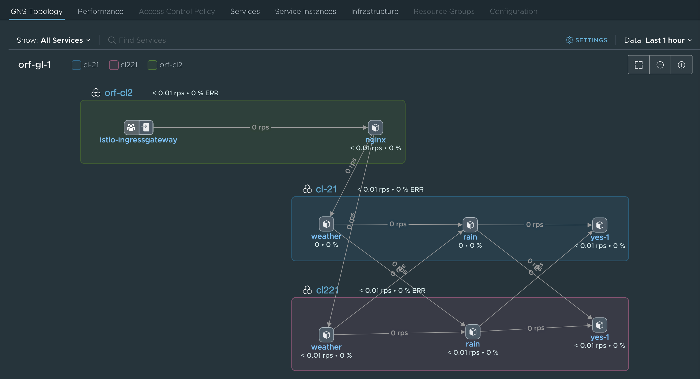
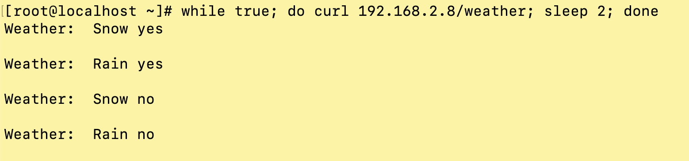

# TSM
Tanzu Service Mesh

**Creating a Tanzu Service Mesh like this:**


* Creating 2 Kubernetes clusters in a "system" that has outbound internet access (to get to TSM (Cloud))
* In this case a vCenter 7 install with Kubernetes is used.

* The Kubernetes cluster creation is done as follows 
  * Log onto Supervisor Cluster
```
/usr/local/bin/kubectl-vsphere login --vsphere-username administrator@vsphere.local --server=https://192.168.2.1 --insecure-skip-tls-verify
```
  * Swap Context
  
```kubectl config use-context namespace1000```
  * Local file for cluster creation
```
kubectl apply -f ./guestcluster1001GA-9workers.yaml.1168tkg21
kubectl apply -f ./guestcluster1001GA-5workers.yaml.1168tkg221
```
  * Remote file for cluster creation
```
kubectl apply -f https://github.com/ogelbric/YAML/raw/master/guestcluster1001GA-9workers.yaml.1168tkg21
kubectl apply -f https://github.com/ogelbric/YAML/raw/master/guestcluster1001GA-5workers.yaml.1168tkg221
```
    
  * Check on the cluster creation and make sure they are in a running state
    * `kubectl get tanzukubernetesclusters`
    ```
    NAME              | CONTROL PLANE   | WORKER   | DISTRIBUTION                      | AGE   | PHASE
    ------------------|-----------------|----------|-----------------------------------|-------|------
    tkg-cluster-21    | 1               | 9        | v1.16.8+vmware.1-tkg.3.60d2ffd    | 23h   | running
    tkg-cluster-221   | 1               | 5        | v1.16.8+vmware.1-tkg.3.60d2ffd    | 24h   | running
    ```
  
* Log onto the TMS console (https://prod-2.nsxservicemesh.vmware.com/home/clusters) and import the 2 clusters ande install TSM
  * `Infrastructure -> Onboard New Cluster`
  * result should look similar to below picture   


* Log onto local cluster 21

```
kubectl vsphere login --server 192.168.2.1 --vsphere-username administrator@vsphere.local --managed-cluster-namespace namespace1000 --managed-cluster-name tkg-cluster-21 --insecure-skip-tls-verify
kubectl config use-context tkg-cluster-2
kubectl apply -f ./authorize-psp-for-gc-service-accounts.yaml
kubectl apply -f https://github.com/ogelbric/YAML/raw/master/authorize-psp-for-gc-service-accounts.yaml
kubectl label ns default istio-injection=enabled
kubectl apply -f ./rainsnowgw.yaml
kubectl apply -f https://github.com/ogelbric/YAML/raw/master/rainsnowgw.yaml
kubectl apply -f ./rainsnowvirtserv.yaml
kubectl apply -f https://github.com/ogelbric/YAML/raw/master/rainsnowvirtserv.yaml
kubectl apply -f ./weather.yaml
kubectl apply -f https://github.com/ogelbric/YAML/raw/master/weather.yaml
kubectl apply -f ./rain1.yaml
kubectl apply -f https://github.com/ogelbric/YAML/raw/master/rain.yaml
kubectl apply -f ./yes1.yaml
kubectl apply -f https://github.com/ogelbric/YAML/raw/master/yes.yaml
```

* Log onto local cluster 221

```
kubectl vsphere login --server 192.168.2.1 --vsphere-username administrator@vsphere.local --managed-cluster-namespace namespace1000 --managed-cluster-name tkg-cluster-221 --insecure-skip-tls-verify
kubectl config use-context tkg-cluster-221
kubectl apply -f ./authorize-psp-for-gc-service-accounts.yaml
kubectl apply -f https://github.com/ogelbric/YAML/raw/master/authorize-psp-for-gc-service-accounts.yaml
kubectl label ns default istio-injection=enabled
kubectl apply -f ./rainsnowgw.yaml
kubectl apply -f https://github.com/ogelbric/YAML/raw/master/rainsnowgw.yaml
kubectl apply -f ./rainsnowvirtserv.yaml
kubectl apply -f https://github.com/ogelbric/YAML/raw/master/rainsnowvirtserv.yaml
kubectl apply -f ./weather.yaml
kubectl apply -f https://github.com/ogelbric/YAML/raw/master/weather.yaml
kubectl apply -f ./rain2.yaml
kubectl apply -f https://github.com/ogelbric/YAML/raw/master/rain2.yaml
kubectl apply -f ./yes2.yaml
kubectl apply -f https://github.com/ogelbric/YAML/raw/master/yes2.yaml
```

* Check on the deployment

```
kubectl get virtualservices
NAME       GATEWAYS         HOSTS   AGE
rainsnow   [acme-gateway]   [*]     76s

kubectl get gw
NAME               AGE
rainsnow-gateway   108s

kubectl get pods 
NAME                      READY   STATUS    RESTARTS   AGE
rain-77d69c9df-ccl7m      2/2     Running   0          2m37s
weather-95dd777cc-wkxnc   2/2     Running   0          2m46s
yes-1-d44d89d66-srw6w     2/2     Running   0          2m31s
```

* Create the Global Name Space (demo.acme.com)


* Run these curl commands to the service endpoints to generate traffic
```
curl `kubectl get svc -A | grep ingressgateway | awk '{ print $5 }'`/weather
curl 192.168.2.2/weather
Weather:  Rain yes

curl `kubectl get svc -A | grep ingressgateway | awk '{ print $5 }'`/weather
curl 192.168.2.3/weather
Weather:  Snow no
```


* Now how to make it look like it is interconnected cluster c21 talking to cluster c221

```
kubectl  edit deployment weather (change value: rain:8080 to rain.demo.acme.com:8080)
kubectl  edit deployment rain    (change value: value: yes-1:8080 to yes-1.demo.acme.com:8080)

```
* Generate traffic to update the Global Name Space

```
[root@localhost ~]# curl 192.168.2.2/weather
Weather:  Rain yes

[root@localhost ~]# curl 192.168.2.2/weather
Weather:  Snow no

[root@localhost ~]# curl 192.168.2.2/weather
Weather:  Rain no

[root@localhost ~]# curl 192.168.2.2/weather
Weather:  Snow no
```
* Result in the Global Name Space


* Now how to make it look like it is interconnected cluster c221 talking to cluster c21

```
kubectl  edit deployment weather (change value: rain:8080 to rain.demo.acme.com:8080)
kubectl  edit deployment rain    (change value: value: yes-1:8080 to yes-1.demo.acme.com:8080)

```

* Generate traffic to update the Global Name Space

```
[root@localhost ~]# curl 192.168.2.3/weather
Weather:  Snow no

[root@localhost ~]# curl 192.168.2.3/weather
Weather:  Rain no

[root@localhost ~]# curl 192.168.2.3/weather
Weather:  Snow yes

[root@localhost ~]# curl 192.168.2.3/weather
Weather:  Rain yes

[root@localhost ~]# 
[root@localhost ~]# curl 192.168.2.2/weather
Weather:  Rain no

[root@localhost ~]# curl 192.168.2.2/weather
Weather:  Snow no

[root@localhost ~]# curl 192.168.2.2/weather
Weather:  Rain yes

[root@localhost ~]# curl 192.168.2.2/weather
Weather:  Snow yes
```

* Resulting Tanzu Service Mesh of the weather app


* Generate constant traffic 

```
watch curl 192.168.2.2/weather
and/or seperate window
watch curl 192.168.2.3/weather

or both in the same window

watch -d ' curl 192.168.2.2/weather; curl 192.168.2.3/weather '

```

* Options to load balance infront of the two istio ingress IP's
   * Add the two IP's to external DNS
   * Create a load balancer some where (b)
   * Create a load balancer in TSM (c)
   * Create a load balancer in TSM and connect back end to the ingress (d)
   * Create an AVI load balancer somewhere 
   
* Install nginx load balancer in different K8 cluster and config map of the two weather services (b)

```
kubectl apply -f https://github.com/ogelbric/YAML/raw/master/nginx-LoadBalancer-weather.yaml

Make sure this section in the YAML relects your weather ingress IP's

      upstream weather {
          server 192.168.2.3:80;
          server 192.168.2.2:80;
      }

```

* The nginx service in TSM (c)

```
kubectl apply -f https://github.com/ogelbric/YAML/raw/master/authorize-psp-for-gc-service-accounts.yaml
Add cluster to TSM
kubectl apply -f https://prod-2.nsxservicemesh.vmware.com/cluster-registration/k8s/v1.5.6/k8s-registration.yaml
kubectl -n allspark create secret generic cluster-token --from-literal=token=eyJh......
kubectl label ns default istio-injection=enabled
Add new cluster (default ns) to global TSM name space
kubectl apply -f https://github.com/ogelbric/YAML/raw/master/LBrainsnowGW.yaml
kubectl apply -f https://github.com/ogelbric/YAML/raw/master/LBrainsnowvirtserv.yaml
kubectl apply -f https://github.com/ogelbric/YAML/raw/master/LB-TSMnginx-LoadBalancer-weather.yaml (this does not have the service loadbalancer in it vs. the  version above)

And lets generate some traffic or we will see no picures in TSM:

watch curl `kubectl get svc -A | grep istio-ingressgateway | awk '{ print $5 }'`/weather

(Note! The out going IP's from ngix LB some how the traffic does not get connected in the below picture, but the all the services are in the global name space)
```

* Resulting picture should look like this: 


* The nginx service in TSM using the istio services in the nginx config map (c)

```
kubectl apply -f https://github.com/ogelbric/YAML/raw/master/LB-TSMnginx-LoadBalancer-weather-with-istioConnection.yaml

And lets not forget to generate traffic for TSM to work:

watch curl `kubectl get svc -A | grep istio-ingressgateway | awk '{ print $5 }'`/weather

```

* Resulting picture should look like this: 



```
And if you don't like the watch commands and to pay tribute to Nathan here is a while loop: 

while true; do curl 192.168.2.8/weather; sleep 2; done

```



* Questions: ogelbrich@vmware.com

Trouble shooting
```
[root@centosrouter 8u0]# k get vs -A
NAMESPACE      NAME                       GATEWAYS                       HOSTS                                                                               AGE
istio-system   nsxsm.gns.orfgns.rain      ["nsxsm-gns-orfgns-rain"]      ["*.rain.demo.acme.com"]                                                            67d
istio-system   nsxsm.gns.orfgns.sun       ["nsxsm-gns-orfgns-sun"]       ["*.sun.demo.acme.com"]                                                             67d
istio-system   nsxsm.gns.orfgns.weather   ["nsxsm-gns-orfgns-weather"]   ["*.weather.demo.acme.com"]                                                         67d
istio-system   nsxsm.gns.orfgns.yes-1     ["nsxsm-gns-orfgns-yes-1"]     ["*.yes-1.demo.acme.com"]                                                           67d
orftsmparis    nsxsm.gns.orfgns.rain                                     ["rain.demo.acme.com","rain.orftsmparis.svc.cluster.local","243.39.26.88"]          77d
orftsmparis    nsxsm.gns.orfgns.sun                                      ["sun.demo.acme.com","sun.orftsmparis.svc.cluster.local","255.44.161.21"]           77d
orftsmparis    nsxsm.gns.orfgns.weather                                  ["weather.demo.acme.com","weather.orftsmparis.svc.cluster.local","247.59.64.115"]   77d
orftsmparis    nsxsm.gns.orfgns.yes-1                                    ["yes-1.demo.acme.com","yes-1.orftsmparis.svc.cluster.local","248.147.12.86"]       77d
orftsmparis    rainsnow                   ["acme-gateway"]               ["*"]                                                                               77d
[root@centosrouter 8u0]# k get gw -A
NAMESPACE      NAME                       AGE
istio-system   istio-egressgateway        77d
istio-system   istio-ingressgateway       77d
istio-system   nsxsm-gns-orfgns-rain      77d
istio-system   nsxsm-gns-orfgns-sun       77d
istio-system   nsxsm-gns-orfgns-weather   77d
istio-system   nsxsm-gns-orfgns-yes-1     77d
orftsmparis    acme-gateway               77d

[root@centosrouter 8u0]# k get svc -A | grep -i ist
istio-system                         istio-egressgateway                      ClusterIP      10.96.121.240   <none>         80/TCP,443/TCP                               77d
istio-system                         istio-ingressgateway                     LoadBalancer   10.96.92.190    192.168.4.79   15021:31291/TCP,80:30970/TCP,443:31282/TCP   77d
istio-system                         istio-telemetry                          ClusterIP      10.96.10.183    <none>         9091/TCP,15004/TCP,15014/TCP,42422/TCP       77d
istio-system                         istiod                                   ClusterIP      10.96.49.168    <none>         15010/TCP,15012/TCP,443/TCP,15014/TCP        77d

```


