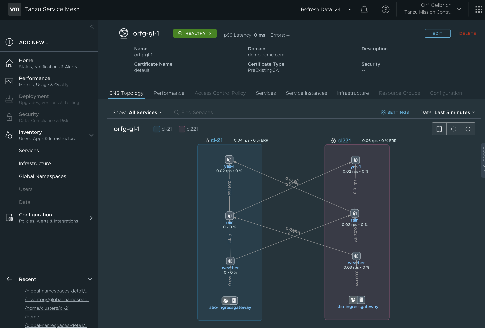
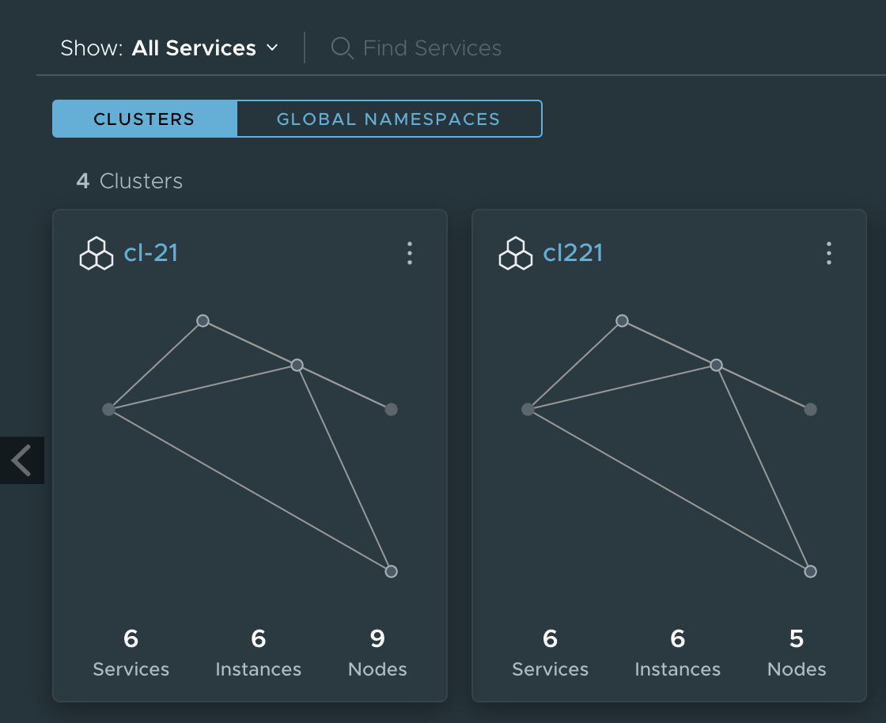

# TSM
Tanzu Service Mesh

**Creating a Tanzu Service Mesh like this:**

* Creating 2 Kubernetes clusters in a "system" that has outbound internet access (to get to TSM (Cloud))
* In this case a vCenter 7 install with Kubernetes is used.

* The Kubernetes cluster creation is done as follows 
  * Log onto Supervisor Cluster
    `/usr/local/bin/kubectl-vsphere login --vsphere-username administrator@vsphere.local --server=https://192.168.2.1 --insecure-skip-tls-verify`
  * Swap Context
    * `kubectl config use-context namespace1000`
  * Local file for cluster creation
    * `kubectl apply -f ./guestcluster1001GA-9workers.yaml.1168tkg21`
    * `kubectl apply -f ./guestcluster1001GA-5workers.yaml.1168tkg221`
  * Remote file for cluster creation
    * `kubectl apply -f https://github.com/ogelbric/YAML/raw/master/guestcluster1001GA-9workers.yaml.1168tkg21`
    * `kubectl apply -f https://github.com/ogelbric/YAML/raw/master/guestcluster1001GA-5workers.yaml.1168tkg221`
    
* Check on the cluster creation and make sure they are in a running state
 * `kubectl get tanzukubernetesclusters`
    NAME              | CONTROL PLANE   | WORKER   | DISTRIBUTION                      | AGE   | PHASE
    ------------------|-----------------|----------|-----------------------------------|-------|------
    tkg-cluster-21    | 1               | 9        | v1.16.8+vmware.1-tkg.3.60d2ffd    | 23h   | running
    tkg-cluster-221   | 1               | 5        | v1.16.8+vmware.1-tkg.3.60d2ffd    | 24h   | running
  
  
  
    
**Create 2 Clusters in TSM**

test r

