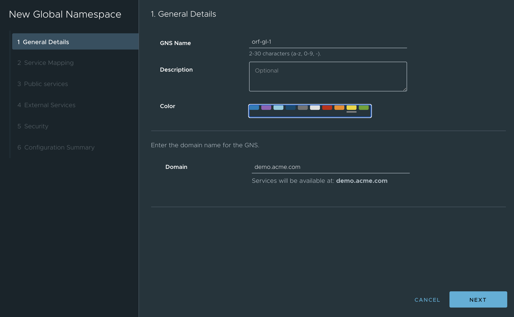
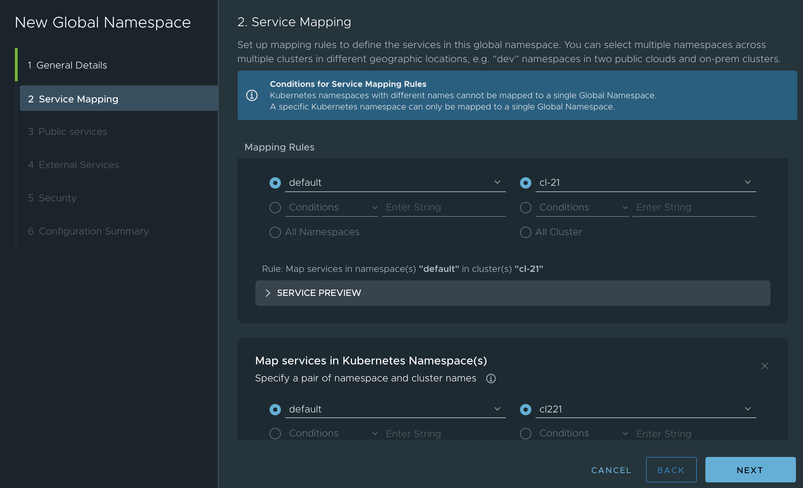
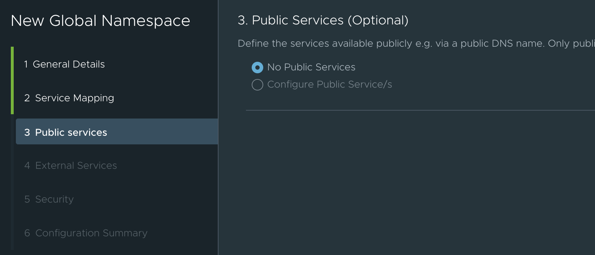
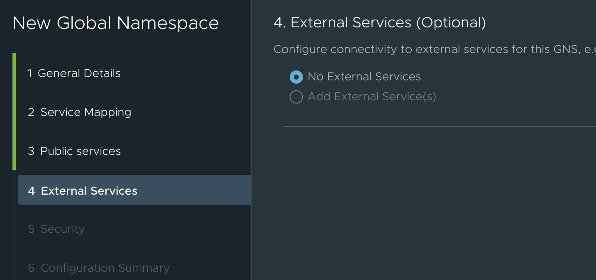
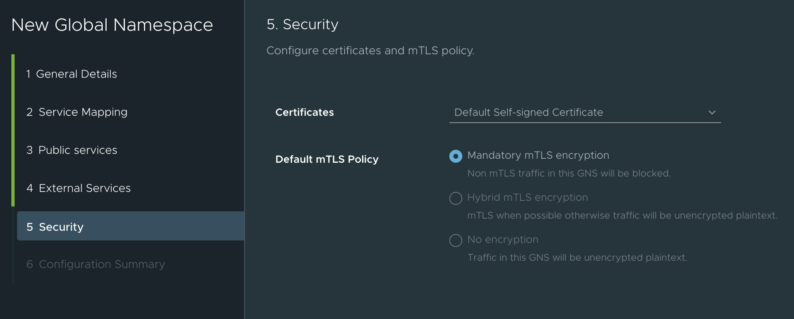
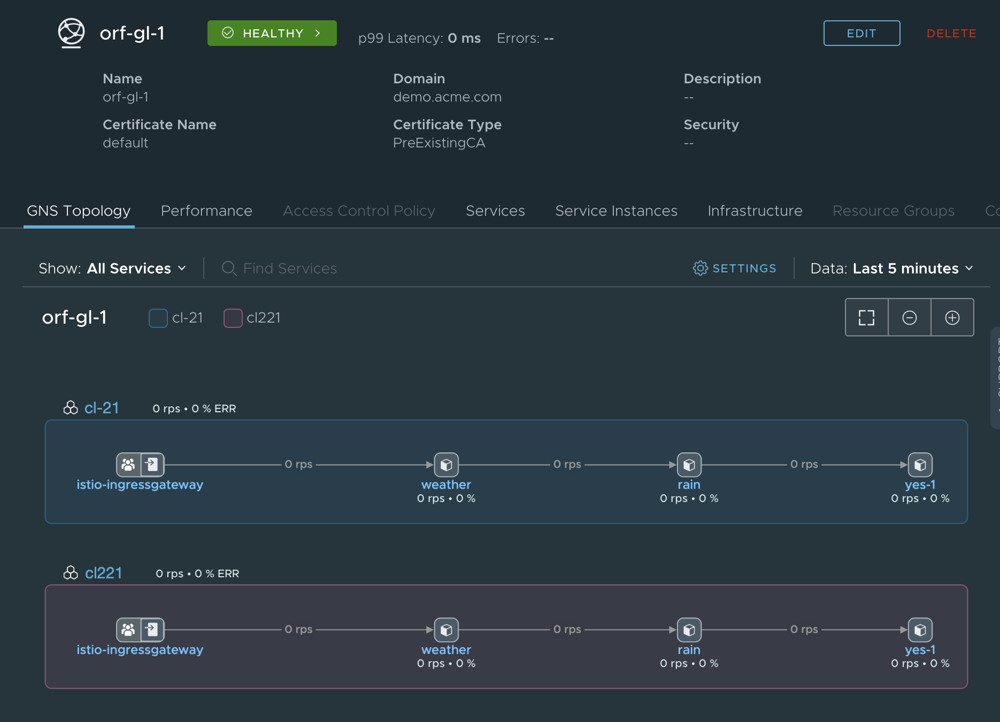
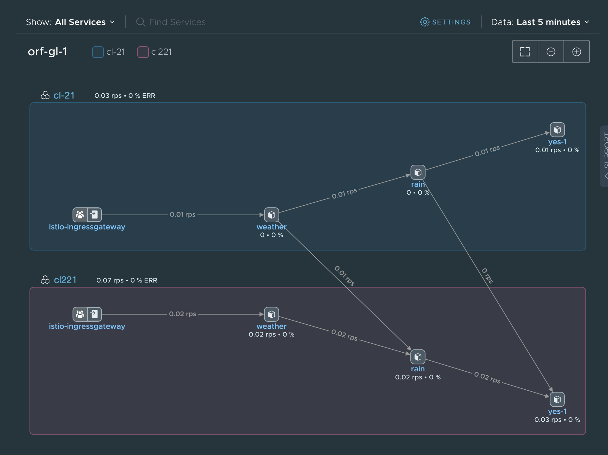
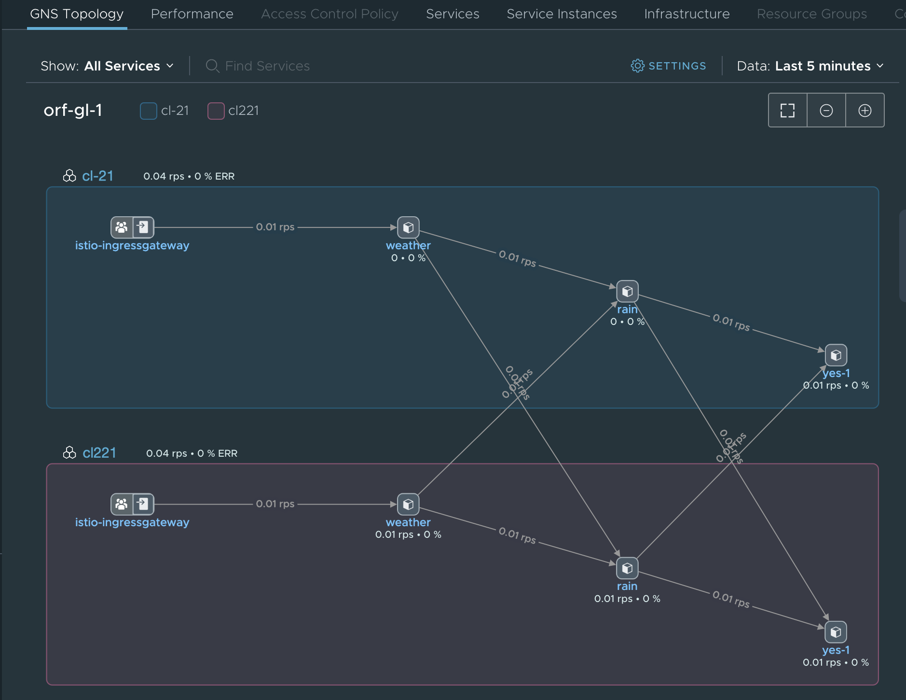
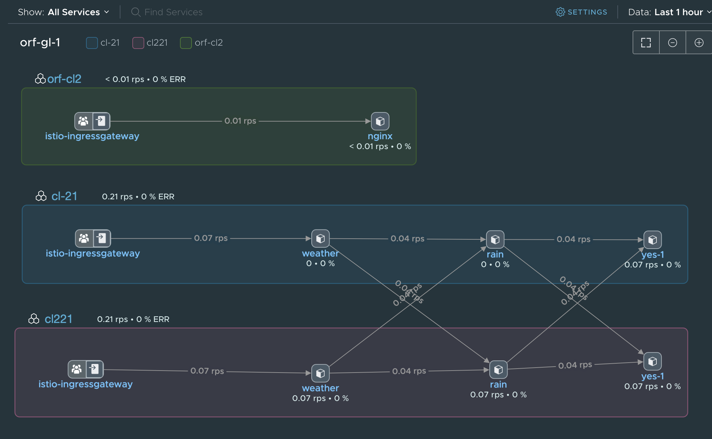

# TSM
Tanzu Service Mesh

**Creating a Tanzu Service Mesh like this:**


* Creating 2 Kubernetes clusters in a "system" that has outbound internet access (to get to TSM (Cloud))
* In this case a vCenter 7 install with Kubernetes is used.

* The Kubernetes cluster creation is done as follows 
  * Log onto Supervisor Cluster
```
/usr/local/bin/kubectl-vsphere login --vsphere-username administrator@vsphere.local --server=https://192.168.2.1 --insecure-skip-tls-verify
```
  * Swap Context
  
```kubectl config use-context namespace1000```
  * Local file for cluster creation
```
kubectl apply -f ./guestcluster1001GA-9workers.yaml.1168tkg21`
kubectl apply -f ./guestcluster1001GA-5workers.yaml.1168tkg221
```
  * Remote file for cluster creation
```
kubectl apply -f https://github.com/ogelbric/YAML/raw/master/guestcluster1001GA-9workers.yaml.1168tkg21
kubectl apply -f https://github.com/ogelbric/YAML/raw/master/guestcluster1001GA-5workers.yaml.1168tkg221
```
    
  * Check on the cluster creation and make sure they are in a running state
    * `kubectl get tanzukubernetesclusters`
    ```
    NAME              | CONTROL PLANE   | WORKER   | DISTRIBUTION                      | AGE   | PHASE
    ------------------|-----------------|----------|-----------------------------------|-------|------
    tkg-cluster-21    | 1               | 9        | v1.16.8+vmware.1-tkg.3.60d2ffd    | 23h   | running
    tkg-cluster-221   | 1               | 5        | v1.16.8+vmware.1-tkg.3.60d2ffd    | 24h   | running
    ```
  
* Log onto the TMS console (https://prod-2.nsxservicemesh.vmware.com/home/clusters) and import the 2 clusters ande install TSM
  * `Infrastructure -> Onboard New Cluster`
  * result should look similar to below picture   


* Log onto local cluster 21

```
kubectl vsphere login --server 192.168.2.1 --vsphere-username administrator@vsphere.local --managed-cluster-namespace namespace1000 --managed-cluster-name tkg-cluster-21 --insecure-skip-tls-verify
kubectl config use-context tkg-cluster-2`
kubectl apply -f ./authorize-psp-for-gc-service-accounts.yaml
kubectl apply -f https://github.com/ogelbric/YAML/raw/master/authorize-psp-for-gc-service-accounts.yaml
kubectl label ns default istio-injection=enabled
kubectl apply -f ./rainsnowgw.yaml
ubectl apply -f https://github.com/ogelbric/YAML/raw/master/rainsnowgw.yaml
kubectl apply -f ./rainsnowvirtserv.yaml
kubectl apply -f https://github.com/ogelbric/YAML/raw/master/rainsnowvirtserv.yaml
kubectl apply -f ./weather.yaml
kubectl apply -f https://github.com/ogelbric/YAML/raw/master/weather.yaml
kubectl apply -f ./rain.yaml
kubectl apply -f https://github.com/ogelbric/YAML/raw/master/rain.yaml
kubectl apply -f ./yes.yaml
kubectl apply -f https://github.com/ogelbric/YAML/raw/master/yes.yaml
```

* Log onto local cluster 221

```
kubectl vsphere login --server 192.168.2.1 --vsphere-username administrator@vsphere.local --managed-cluster-namespace namespace1000 --managed-cluster-name tkg-cluster-221 --insecure-skip-tls-verify
kubectl config use-context tkg-cluster-221
kubectl apply -f ./authorize-psp-for-gc-service-accounts.yaml
kubectl apply -f https://github.com/ogelbric/YAML/raw/master/authorize-psp-for-gc-service-accounts.yaml
kubectl label ns default istio-injection=enabled
kubectl apply -f ./rainsnowgw.yaml
kubectl apply -f https://github.com/ogelbric/YAML/raw/master/rainsnowgw.yaml
kubectl apply -f ./rainsnowvirtserv.yaml
kubectl apply -f https://github.com/ogelbric/YAML/raw/master/rainsnowvirtserv.yaml
kubectl apply -f ./weather.yaml
kubectl apply -f https://github.com/ogelbric/YAML/raw/master/weather.yaml
kubectl apply -f ./rain2.yaml
kubectl apply -f https://github.com/ogelbric/YAML/raw/master/rain2.yaml
kubectl apply -f ./yes2.yaml
kubectl apply -f https://github.com/ogelbric/YAML/raw/master/yes2.yaml
```

* Check on the deployment

```
kubectl get virtualservices
NAME       GATEWAYS         HOSTS   AGE
rainsnow   [acme-gateway]   [*]     76s

kubectl get gw
NAME               AGE
rainsnow-gateway   108s

kubectl get pods 
NAME                      READY   STATUS    RESTARTS   AGE
rain-77d69c9df-ccl7m      2/2     Running   0          2m37s
weather-95dd777cc-wkxnc   2/2     Running   0          2m46s
yes-1-d44d89d66-srw6w     2/2     Running   0          2m31s
```

* Create the Global Name Space (demo.acme.com)












* Run these curl commands to the service endpoints to generate traffic
```
curl `kubectl get svc -A | grep ingressgateway | awk '{ print $5 }'`/weather
curl 192.168.2.2/weather
Weather:  Rain yes

curl `kubectl get svc -A | grep ingressgateway | awk '{ print $5 }'`/weather
curl 192.168.2.3/weather
Weather:  Snow no
```



* Now how to make it look like it is interconnected cluster c21 talking to cluster c221

```
kubectl  edit deployment weather (change value: rain:8080 to rain.demo.acme.com:8080)
kubectl  edit deployment rain    (change value: value: yes-1:8080 to yes-1.demo.acme.com:8080)

```
* Generate traffic to update the Global Name Space

```
[root@localhost ~]# curl 192.168.2.2/weather
Weather:  Rain yes

[root@localhost ~]# curl 192.168.2.2/weather
Weather:  Snow no

[root@localhost ~]# curl 192.168.2.2/weather
Weather:  Rain no

[root@localhost ~]# curl 192.168.2.2/weather
Weather:  Snow no
```
* Result in the Global Name Space



* Now how to make it look like it is interconnected cluster c221 talking to cluster c21

```
kubectl  edit deployment weather (change value: rain:8080 to rain.demo.acme.com:8080)
kubectl  edit deployment rain    (change value: value: yes-1:8080 to yes-1.demo.acme.com:8080)

```

* Generate traffic to update the Global Name Space

```
[root@localhost ~]# curl 192.168.2.3/weather
Weather:  Snow no

[root@localhost ~]# curl 192.168.2.3/weather
Weather:  Rain no

[root@localhost ~]# curl 192.168.2.3/weather
Weather:  Snow yes

[root@localhost ~]# curl 192.168.2.3/weather
Weather:  Rain yes

[root@localhost ~]# 
[root@localhost ~]# curl 192.168.2.2/weather
Weather:  Rain no

[root@localhost ~]# curl 192.168.2.2/weather
Weather:  Snow no

[root@localhost ~]# curl 192.168.2.2/weather
Weather:  Rain yes

[root@localhost ~]# curl 192.168.2.2/weather
Weather:  Snow yes
```

* Resulting Tanzu Service Mesh of the weather app



* Generate constant traffic 

```
watch curl 192.168.2.2/weather
and/or seperate window
watch curl 192.168.2.3/weather

or both in the same window

watch -d ' curl 192.168.2.2/weather; curl 192.168.2.3/weather '

```

* Install a nginx load balancer in a different K8 cluster infront of the two weather services


```
kubectl apply -f https://github.com/ogelbric/YAML/raw/master/nginx-LoadBalancer-weather.yaml

Make sure this section in the YAML relects your weather ingress IP's

      upstream weather {
          server 192.168.2.3:80;
          server 192.168.2.2:80;
      }

```

* If the nginx service is also desired in TSM then this can be deployed

```
kubectl apply -f ./authorize-psp-for-gc-service-accounts.yaml
Add cluster to TSM
kubectl apply -f https://prod-2.nsxservicemesh.vmware.com/cluster-registration/k8s/v1.5.6/k8s-registration.yaml
kubectl -n allspark create secret generic cluster-token --from-literal=token=eyJh......
kubectl label ns default istio-injection=enabled
Add new cluster (default ns) to global TSM name space
kubectl apply -f ./LBrainsnowGW.yaml
kubectl apply -f ./LBrainsnowvirtserv.yaml
kubectl apply -f ./LB-TSMnginx-LoadBalancer-weather.yaml.    (this does not have the service loadbalancer in it vs. from the above version)

```

* Resulting picture should look like this: 



* Questions: ogelbrich@vmware.com


